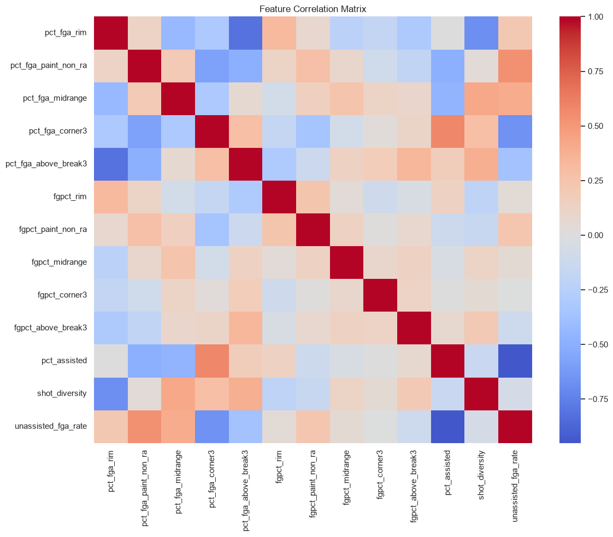
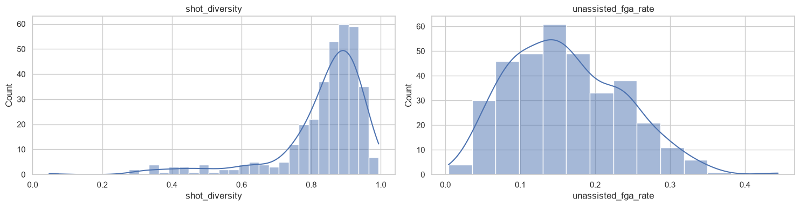
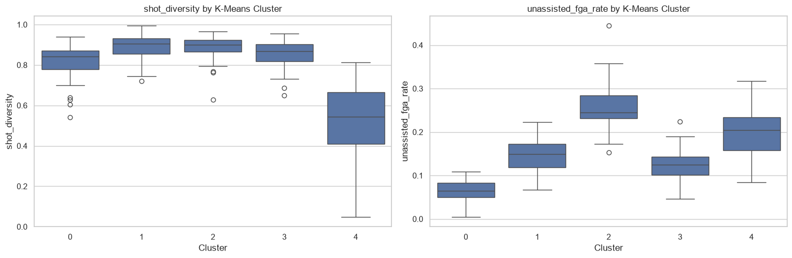
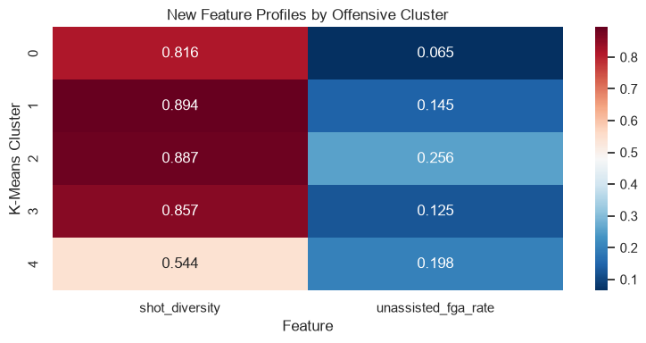
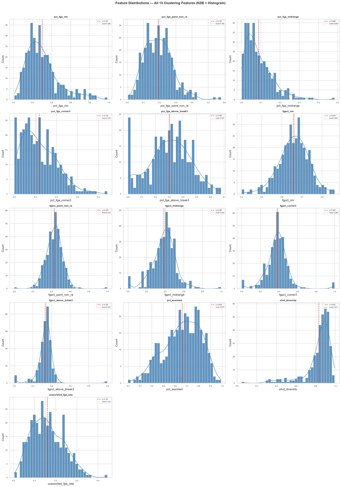
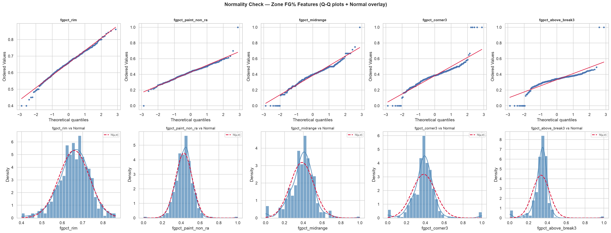
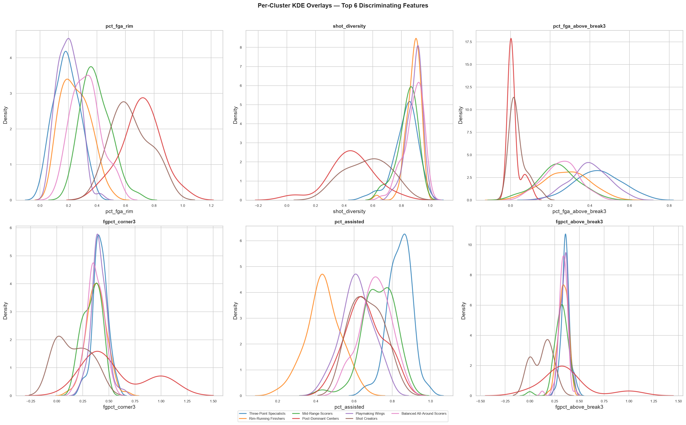

# PROJECT AUDIT

## VERSION 0: State Log (as of 9 August 2026):

### Features I'm Using
I'm currently using **15 standardized features**, split into four groups:
- Shot-location frequency: rim, paint, midrange, corner 3, above-the-break 3
- Zone efficiency: FG% in each of those five zones
- Shot-selection aggregates: three-point rate, rim-plus-three rate, midrange rate
- Shot creation: assisted-FG%, unassisted-FG%

There are a couple issues I've taken note of:

- Midrange frequency and midrange attempt rate are the same thing. One can be deleted for redundancy.
- The three-point attempt rate is mathematically derived from corner 3 and above-the-break 3 frequency numbers.
- In that same avenue, rim-plus-three rate can be mathematically derived from other numbers.
- Not sure if this is a major issue, but you can derive assisted-FG% from unassisted-FG% and vice-versa. I could eliminate one of these features to reduce redundancy.
- Zone-level FG% can be noisy even after filtering the players down to 200 total shot attempts.

### How I'm currently clustering:
The primary model is K-means with k=5, using the aforementioned features and random_state=42. The dataset contains 350 players after filtering out all players who took under 200 shot attempts for the season.

The notebook also fits two other models (Gaussian Mixture and Agglomeritave Clustering), but this is mainly for future work regarding robustness comparison.

The intended archetypes are:

- Balanced Wing
- Midrange Scorer
- 3-and-D
- Rim Runner
- Shot Creator

I started with five clusters just as a baseline, but domain intuition won't be enough. The next step is stability and validation across k.

### Validation
I currently have two quantitative metrics:

- Silhouette: 0.135
- Davies-Bouldin: 1.770

I also have PCA visualization and cluster-profile analysis through a feature heatmap. It's recommended to manually check players against their clusters and see if they fit the proper description (spoiler: couple mismatches, most notably Curry listed as a balanced wing).

Perhaps the most major issue with a project like this is that there is no ground-truth dataset for me to validate with. A lot of this validation ends up being subjective.

It is thus important for me to not only improve the clustering but also the validation and archetype-labeling. Players like Alex Caruso get labeled as a "rim-runner" despite very clearly being not that. There might be value in weighting more heavily towards the attempt heatmap. Caruso's weak 3FG% this past season could be a source of his given label.

### Exporting
The notebook exports a JSON that contains all of the features, as well as the names, IDs, and archetypes for each player in the cleaned dataset. My website (https://ibisboard.vercel.app/sports/offensive-profiles) then reads this and prints out the data in a readable, searchable manner.

### Pipeline
The pipeline is thus: 
1. NBA API
2. Python/Notebook
3. CSV Cache
4. Feature Engineering
5. Clustering
6. JSON
7. Website

## What I want to do

### Feature Engineering

- Remove redundant features
- Reevaluate the 200 FGA bar.
- Investigate the treatment of low-efficiency zones.
- Add more context (investigate NBA API documentation for this) such as dribbling, touch time, etc.
- Document why for each of the final features.

### Validation

- Evaluate more values of k.
- In doing so, compare the metrics being used to evaluate the model.
- Use different random_state seeds.
- Compare K-Means versus GMM and hierarchical clustering.
- Manually create a new, smaller dataset of players with set-in-stone archetypes to compare against.
- IMPORTANT: cluster quality vs. basketball usefulness.

### Documentation

- Document the entire data pipeline.
- Record the final features as well as their rationale.
- Record the parameters and evaluation metrics with each export.

### Further Plans

I want to move this from just a notebook to a more repeatable pipeline, especially modular if possible in order to get more years and better outputs. Below are some of my thoughts:

- Extending this work to years past (and the can of worms that opens)
- Storing the model's metadata alongside the player output.
- Handling players changing teams
- Ensuring the output schema stays the same for frontend stability throughout modeling process changes
- Scaling to career-level archetypes

### Metrics
Silhouette score: 0.130
Davies-Bouldin index: 1.834

Important graphs can be found in the version folders (v0, v1, etc.). The ones I'm honing in on are elbow, silhouette, feature value heatmap, and PCA. 

## VERSION 1: Feature Engineering

### Are these features linearly separable?

No, since that isn't a requirement for an unsupervised clustering model. I need to focus on whether the features form meaningful regions in feature space. I also need to figure out whether transformations or redundant features are distoring Euclidean distance.

### Changelog and Analysis

Removed redundant features:

- three_point_rate
- rim_plus_three_rate
- midrange_rate
- pct_unassisted

Added three new features:

- shot_diversity: calculated with Shannon Entropy. Does this player specialize heavily in one type of shot, or do they distribute their offense across many areas?
- efg_pct: effective field goal percentage. Think of it as an overall fg% across all the zones.
- unassisted_fga_rate: manually calculated now.

### Metrics

ALL THREE NEW FEATURES
Silhouette score: 0.121 
Davies-Bouldin index: 1.986

SHOT DIVERSITY ONLY
Silhouette score: 0.124
Davies-Bouldin index: 1.850

EFG PCT ONLY
Silhouette score: 0.124
Davies-Bouldin index: 1.785

UNASSISTED FGA RATE ONLY
Silhouette score: 0.129
Davies-Bouldin index: 1.802

SHOT DIVERSITY + EFG PCT
Silhouette score: 0.119
Davies-Bouldin index: 1.947

SHOT DIVERSITY + UNASSISTED FGA RATE
Silhouette score: 0.126
Davies-Bouldin index: 1.781

EFG PCT + UNASSISTED FGA RATE
Silhouette score: 0.116
Davies-Bouldin index: 1.814

After analyzing these metrics and the graphs given by analyzing the new features, I decided to delete efg.
New feature metrics:

Why the two features matter: unassisted_fga_rate adds upon pct_assisted by making it a per-attempt stat, so it doesn't get confounded by make rate. shot_diversity uses a normalized Shannon entropy - 0 = a one-zone specialist, 1 is evenly spread. Tells a story of balance vs. one-trick.

I found unassisted_fga_rate to actually push itself to the very front of the 13 features with an F-score of 240.1 to a p-score of 3e-98. Shot_diversity is not far behind as a top-4 feature with 147.4 F-score and 2e-73 p-value. Important stuff!

Silhouette score: 0.126
Davies-Bouldin index: 1.781

## VERSION 2: Clustering Tweaks

### What I'm Doing

Tweaking my cluster count both due to domain knowledge and the 2nd cluster having a large imbalance of players (109 to an average about 60 players for the other four clusters). I think I might cap out at 8 or 9 to avoid overfitting. Lowering it is probably not helpful, but I am curious.

### Analysis

I got pretty much what I expected out of the testing by testing k = 2-8, with a noticeable boost in the third cluster (can be ignored) and a big red sign screaming "LOOK AT SIX AND SEVEN!"

I graphed their differences in both silhouette and Davies-Bouldin, can be found in the notebook, probably, and saved in the v2 folder.

Next, I looked a bit closer at the metrics for k=6 and k=7.

**K = 6:**

=== K=6 Inspection ===
Cluster sizes:
cluster_k6
0      5
1     83
2     52
3     55
4    118
5     37
Name: count, dtype: int64

Cluster profiles:
            pct_fga_rim  pct_fga_paint_non_ra  pct_fga_midrange  \
cluster_k6                                                        
0                 0.656                 0.240             0.072   
1                 0.247                 0.254             0.159   
2                 0.374                 0.136             0.036   
3                 0.170                 0.098             0.058   
4                 0.246                 0.198             0.094   
5                 0.637                 0.251             0.035   

            pct_fga_corner3  pct_fga_above_break3  fgpct_rim  \
cluster_k6                                                     
0                     0.003                 0.029      0.691   
1                     0.057                 0.283      0.657   
2                     0.202                 0.251      0.657   
3                     0.211                 0.463      0.653   
4                     0.115                 0.347      0.643   
5                     0.024                 0.052      0.719   

            fgpct_paint_non_ra  fgpct_midrange  fgpct_corner3  \
cluster_k6                                                      
0                        0.431           0.310          1.000   
1                        0.456           0.414          0.383   
2                        0.344           0.272          0.346   
3                        0.417           0.422          0.412   
4                        0.437           0.406          0.400   
5                        0.478           0.380          0.253   

            fgpct_above_break3  pct_assisted  shot_diversity  \
cluster_k6                                                     
0                        0.188         0.601           0.527   
1                        0.336         0.451           0.888   
2                        0.316         0.736           0.849   
3                        0.363         0.848           0.817   
4                        0.346         0.680           0.893   
5                        0.274         0.680           0.552   

            unassisted_fga_rate  
cluster_k6                       
0                         0.240  
1                         0.256  
2                         0.120  
3                         0.066  
4                         0.143  
5                         0.193  

Sample players per cluster:
  Cluster 0 (n=5): ['Clint Capela', 'Giannis Antetokounmpo', 'Jonas Valanciunas', 'Mark Williams']
  Cluster 1 (n=83): ['Ajay Mitchell', 'Alperen Sengun', 'Andrew Nembhard', 'Anfernee Simons']
  Cluster 2 (n=52): ['Andre Drummond', 'Ben Saraf', 'Bilal Coulibaly', 'Bruce Brown']
  Cluster 3 (n=55): ['AJ Green', 'Aaron Nesmith', 'Al Horford', 'Alex Caruso']
  Cluster 4 (n=118): ['Aaron Gordon', 'Aaron Holiday', 'Aaron Wiggins', 'Ace Bailey']
  Cluster 5 (n=37): ['Adem Bona', 'Amen Thompson', 'Anthony Gill', 'Ausar Thompson']

**K = 7:**

=== K=7 Inspection ===
Cluster sizes:
cluster_k7
0    67
1    71
2    45
3    17
4    69
5    17
6    64
Name: count, dtype: int64

Cluster profiles:
            pct_fga_rim  pct_fga_paint_non_ra  pct_fga_midrange  \
cluster_k7                                                        
0                 0.187                 0.109             0.057   
1                 0.250                 0.257             0.161   
2                 0.391                 0.135             0.035   
3                 0.707                 0.229             0.039   
4                 0.199                 0.177             0.114   
5                 0.637                 0.269             0.035   
6                 0.324                 0.237             0.078   

            pct_fga_corner3  pct_fga_above_break3  fgpct_rim  \
cluster_k7                                                     
0                     0.204                 0.443      0.655   
1                     0.052                 0.279      0.661   
2                     0.200                 0.239      0.662   
3                     0.008                 0.017      0.717   
4                     0.110                 0.400      0.598   
5                     0.021                 0.038      0.710   
6                     0.107                 0.254      0.694   

            fgpct_paint_non_ra  fgpct_midrange  fgpct_corner3  \
cluster_k7                                                      
0                        0.418           0.409          0.418   
1                        0.463           0.416          0.380   
2                        0.339           0.268          0.336   
3                        0.496           0.401          0.565   
4                        0.401           0.431          0.406   
5                        0.456           0.307          0.158   
6                        0.469           0.382          0.368   

            fgpct_above_break3  pct_assisted  shot_diversity  \
cluster_k7                                                     
0                        0.363         0.839           0.829   
1                        0.337         0.439           0.884   
2                        0.314         0.729           0.841   
3                        0.370         0.659           0.447   
4                        0.347         0.616           0.890   
5                        0.122         0.667           0.558   
6                        0.335         0.710           0.884   

            unassisted_fga_rate  
cluster_k7                       
0                         0.071  
1                         0.264  
2                         0.123  
3                         0.216  
4                         0.162  
5                         0.197  
6                         0.143  

Sample players per cluster:
  Cluster 0 (n=67): ['AJ Green', 'Aaron Holiday', 'Aaron Nesmith', 'Al Horford']
  Cluster 1 (n=71): ['Ajay Mitchell', 'Alperen Sengun', 'Andrew Nembhard', 'Anfernee Simons']
  Cluster 2 (n=45): ['Andre Drummond', 'Ben Saraf', 'Bilal Coulibaly', 'Bruce Brown']
  Cluster 3 (n=17): ['Adem Bona', 'Clint Capela', 'Daniel Gafford', 'Deandre Ayton']
  Cluster 4 (n=69): ['Aaron Wiggins', 'Andrew Wiggins', 'Ayo Dosunmu', 'Bennedict Mathurin']
  Cluster 5 (n=17): ['Amen Thompson', 'Ausar Thompson', "Day'Ron Sharpe", 'Domantas Sabonis']
  Cluster 6 (n=64): ['Aaron Gordon', 'Ace Bailey', 'Alex Sarr', 'Anthony Black']

The biggest backbreaker here, alongside its obviously worse metrics, is K=6's cluster with 5 players. So I've settled on 7. It performs slightly worse than K=5, but we will have to make that sacrifice for wider breadth.

### Archetype Naming
K=7 identifies seven distinct, basketball-meaningful archetypes:

1. **Three-Point Role Players (n=67):** Low-volume perimeter specialists, high assists
   - Example: AJ Green, Aaron Nesmith, Al Horford
   - Profile: 64.7% from 3pt range, 83.9% assisted makes

2. **Two-Level Scorers (n=71):** Balanced scorers with high shot diversity
   - Example: Alperen Sengun, Anfernee Simons
   - Profile: Shot diversity 0.884, mid-range on most dimensions

3. **Corner Specialists (n=45):** Role players, corner-oriented, mid-post
   - Example: Andre Drummond, Bruce Brown
   - Profile: 39.1% rim, 20% corner-3, 72.9% assisted

4. **Elite Post Scorers (n=17):** High-volume finishers, efficient from restricted area
   - Example: Clint Capela, Domantas Sabonis, DeAaron Ayton
   - Profile: 70.7% rim, nearly 0% 3pt volume, efficient (72% rim FG%)

5. **Playmaking Wings (n=69):** Primary creators, balanced outside game
   - Example: Aaron Wiggins, Andrew Wiggins
   - Profile: 40% above-break 3s, 0.890 shot diversity, mid assists

6. **Rim Runners (n=17):** Finishers with limited outside game
   - Example: Amen Thompson, Ausar Thompson, Day'Ron Sharpe
   - Profile: 63.7% rim, <6% 3pt, limited ball-handling

7. **Three-Level Scorers (n=64):** Mid-range oriented, mixed scoring
   - Example: Aaron Gordon, Anthony Black
   - Profile: 32.4% rim, 23.7% paint, 25.4% above-break 3s

### Metrics

Silhouette score: 0.124
Davies-Bouldin index: 1.766

## Validation Audit (17 August):

### Raw Data Validation

- **Result**: Pass
- **Players**: 350 / 582 after 200 FGA filter
- **Issues Found**:
  - NaN counts: 0
  - Duplicates: 0
  - Out-of-range values: 0

### Feature Engineering Validation

- **Result**: Pass
- **Features Checked**: 13 columns
- **NaN Summary**: 0
- **Outliers Detected**: 0
- **Range Violations**: 0

### Scaling Validation

- **Result**: Pass
- **Matrix Shape**: (350, 13)
- **Mean-of-means**: 8.969626018729837e-17
- **Std-of-stds**: 7.542480201369688e-17

### Export Validation

- **Result**: Pass
- **Players Exported**: 350
- **Clusters**: 7
- **Cluster Sizes**: {1: 71, 4: 69, 0: 67, 6: 64, 2: 45, 3: 17, 5: 17}
- **Required Fields NaN**: 0

### Cluster Interpretation

- Graphed feature importances
- Graphed cluster sizes
- Graphed each cluster's normalized profile across all of the features into radar graphs
- Generated descriptions for each of the clusters

Graphs can be found in v2 folder. Cluster interpretation report:

================================================================================
CLUSTER INTERPRETATION REPORT
================================================================================

────────────────────────────────────────────────────────────────────────────────
CLUSTER 0
────────────────────────────────────────────────────────────────────────────────
Size: 67 players (19.1% of dataset)

Description:
  Three-point specialists who thrive in catch-and-shoot roles, often assisted baskets.

Key Distinguishing Traits:
  • Frequent 3-point shooter (44.3%)
  • Avoids rim (18.7% of shots)
  • Mostly assisted baskets (83.9%)

Example Players (by volume):
  1. Kon Knueppel
  2. Trey Murphy III
  3. Toumani Camara
  4. Donte DiVincenzo
  5. Tim Hardaway Jr.

Top Feature Extremes:
  • pct_fga_above_break3: 0.443 (high)
  • pct_fga_rim: 0.187 (low)
  • pct_assisted: 0.839 (high)

────────────────────────────────────────────────────────────────────────────────
CLUSTER 1
────────────────────────────────────────────────────────────────────────────────
Size: 71 players (20.3% of dataset)

Description:
  Self-sufficient scorers who create their own shots across multiple zones; low assist dependency.

Key Distinguishing Traits:
  • Self-creates heavily (43.9% assisted)
  • Avoids rim (25.0% of shots)

Example Players (by volume):
  1. Jaylen Brown
  2. Tyrese Maxey
  3. Jalen Brunson
  4. Luka Dončić
  5. Donovan Mitchell

Top Feature Extremes:
  • pct_assisted: 0.439 (low)
  • pct_fga_rim: 0.250 (low)
  • shot_diversity: 0.884 (high)

────────────────────────────────────────────────────────────────────────────────
CLUSTER 2
────────────────────────────────────────────────────────────────────────────────
Size: 45 players (12.9% of dataset)

Description:
  Balanced offensive player with usage across zones and assist patterns.

Key Distinguishing Traits:

Example Players (by volume):
  1. Matas Buzelis
  2. OG Anunoby
  3. Quentin Grimes
  4. Jerami Grant
  5. Kel'el Ware

Top Feature Extremes:
  • fgpct_midrange: 0.268 (low)
  • pct_fga_corner3: 0.200 (high)
  • fgpct_paint_non_ra: 0.339 (low)

────────────────────────────────────────────────────────────────────────────────
CLUSTER 3
────────────────────────────────────────────────────────────────────────────────
Size: 17 players (4.9% of dataset)

Description:
  Post scorers and mid-range threats; score a mix of assisted and self-created baskets.

Key Distinguishing Traits:
  • Rim-heavy shot diet (70.7% of shots)
  • Rarely shoots 3s (1.7%)

Example Players (by volume):
  1. Zion Williamson
  2. Jalen Duren
  3. Deandre Ayton
  4. Giannis Antetokounmpo
  5. Ivica Zubac

Top Feature Extremes:
  • pct_fga_rim: 0.707 (high)
  • shot_diversity: 0.447 (low)
  • pct_fga_above_break3: 0.017 (low)

────────────────────────────────────────────────────────────────────────────────
CLUSTER 4
────────────────────────────────────────────────────────────────────────────────
Size: 69 players (19.7% of dataset)

Description:
  Three-point specialists who thrive in catch-and-shoot roles, often assisted baskets.

Key Distinguishing Traits:
  • Avoids rim (19.9% of shots)
  • Frequent 3-point shooter (40.0%)

Example Players (by volume):
  1. LaMelo Ball
  2. Desmond Bane
  3. Nickeil Alexander-Walker
  4. Derrick White
  5. Brandon Miller

Top Feature Extremes:
  • pct_fga_rim: 0.199 (low)
  • pct_fga_above_break3: 0.400 (high)
  • shot_diversity: 0.890 (high)

────────────────────────────────────────────────────────────────────────────────
CLUSTER 5
────────────────────────────────────────────────────────────────────────────────
Size: 17 players (4.9% of dataset)

Description:
  Post scorers and mid-range threats; score a mix of assisted and self-created baskets.

Key Distinguishing Traits:
  • Rim-heavy shot diet (63.7% of shots)

Example Players (by volume):
  1. Amen Thompson
  2. Dyson Daniels
  3. Nic Claxton
  4. Ausar Thompson
  5. Jarrett Allen

Top Feature Extremes:
  • pct_fga_rim: 0.637 (high)
  • fgpct_corner3: 0.158 (low)
  • shot_diversity: 0.558 (low)

────────────────────────────────────────────────────────────────────────────────
CLUSTER 6
────────────────────────────────────────────────────────────────────────────────
Size: 64 players (18.3% of dataset)

Description:
  Balanced offensive player with usage across zones and assist patterns.

Key Distinguishing Traits:
  • Avoids rim (32.4% of shots)
  • Mostly assisted baskets (71.0%)

Example Players (by volume):
  1. Bam Adebayo
  2. Victor Wembanyama
  3. Miles Bridges
  4. Karl-Anthony Towns
  5. Jabari Smith Jr.

Top Feature Extremes:
  • shot_diversity: 0.884 (high)
  • pct_fga_rim: 0.324 (low)
  • pct_assisted: 0.710 (high)

================================================================================

## VERSION 3: Feature Distribution Analysis
 
### Motivation
 
Before I commit to any conclusion drawn from the clusters, I need to know what the feature space actually looks like:

1. What are the raw distributions of EVERY feature?
2. Are the five zone-FG% features normally distributed? (Spoiler: no.) If not, why, and does it matter for K-Means?
3. Do different clusters actually have *different* distributions on the features that most separate them? Or did K-Means just slice noise?
 
### Step 1: Full Histograms for All 13 Features
 

 
I plotted every feature in a 5×3 grid with KDE overlays and mean/median lines, then built a descriptive-stats table sorted by absolute skew:
 
| Feature | Mean | Std | Skew | Kurtosis | Why? |
|---|---|---|---|---|---|
| `shot_diversity` | 0.832 | 0.137 | **−2.32** | 6.30 | Most players spread shots broadly. |
| `pct_fga_midrange` | 0.089 | 0.071 | **+1.54** | 3.57 | Midrange is rare league-wide. Median player takes ~7%. A small right tail of dedicated midrange scorers pulls the skew. |
| `pct_fga_rim` | 0.301 | 0.170 | **+1.26** | 1.72 | Most players are rim-light; a minority are rim-heavy. Right-skewed. |
| `fgpct_corner3` | 0.383 | 0.125 | **+1.05** | 8.13 | Right-skewed. |
| `fgpct_above_break3` | 0.332 | 0.091 | **+0.90** | **18.74** | Highest kurtosis in the set. |
| Remaining 8 features | — | — | −0.43 to +0.79 | −0.45 to +5.49 | Mild-to-moderate skew, nothing alarming. |
 
Takeaways:
- `shot_diversity` is the most non-normal feature by skew — it's ceiling-capped at 1.0, and nearly everyone clusters near the top. That's fine for clustering (it still separates the specialists from the generalists).
- The FG% features deserve their own section (Step 2).
 
---
 
### Step 2: Normality Analysis of Zone FG%
 

 
I ran two formal tests per `fgpct_*` feature: Shapiro-Wilk and D'Agostino & Pearson's K²:
 
| Feature | Shapiro W | Shapiro p | D'Agostino K² | D'Agostino p | Normal? |
|---|---|---|---|---|---|
| `fgpct_rim` | 0.991 | **0.025** | 10.83 | 0.004 | Barely rejected (α = 0.05) |
| `fgpct_paint_non_ra` | 0.953 | <10⁻⁶ | 55.91 | <10⁻⁶ | Strongly rejected |
| `fgpct_midrange` | 0.959 | <10⁻⁶ | 27.11 | 10⁻⁵ | Strongly rejected |
| `fgpct_corner3` | 0.855 | <10⁻⁶ | 111.39 | <10⁻⁶ | Massively rejected |
| `fgpct_above_break3` | 0.729 | <10⁻⁶ | 136.65 | <10⁻⁶ | Massively rejected |
 
**Why they can't be normal — three structural reasons:**
 
1. **Bounded [0, 1] domain.** A normal distribution has infinite support (−∞, +∞). FG% is a proportion. Even if the histogram looks vaguely bell-shaped, the tails are compressed. `fgpct_rim` rides near 0.66, leaving asymmetric headroom: 0.34 up vs. 0.66 down. No true normal can be asymmetric like that.
 
2. **Binomial proportions with wildly unequal sample sizes.** Each player's zone FG% is successes / attempts. The variance of a binomial proportion is `p(1−p)/n`. One player's corner-3 FG% comes from 2 attempts; another's from 152. The low-volume rates are pure noise, injecting heavy tails.
 
3. **Median-fill artifact creates a synthetic mode.** Players with zero attempts in a zone get filled to the league median (Step 4/5 of the pipeline). For `fgpct_corner3` and `fgpct_above_break3`, this means dozens of non-shooters all land on the exact same values (~0.38 and ~0.33), creating a spike in the density. The result is a bimodal or spike-at-center distribution — plainly visible in the Q-Q plots as a horizontal cluster of points — which is as far from normal as a proportion can get. This is why `fgpct_above_break3` has kurtosis = 18.74.
 
**Does this matter for K-Means?** No — K-Means doesn't assume normality. But it *does* matter for interpreting centroids. A cluster mean on `fgpct_corner3` near 0.38 could mean "average corner shooter" or "cluster full of non-shooters filled to the median." Those are very different basketball stories, and the median-fill can obscure which one is true. In a future version, I'd consider adding a binary "shot-from-this-zone" flag alongside each FG% so the clustering can distinguish non-shooters from bad shooters.
 
---
 
### Step 3: Do Different Clusters Have Different Distributions?
 

 
I picked the 6 features with the largest centroid range across clusters (i.e., the features that most discriminate one cluster from another): `pct_fga_rim`, `shot_diversity`, `pct_fga_above_break3`, `fgpct_corner3`, `pct_assisted`, and `fgpct_above_break3`. For each, I overlaid KDEs of all 7 clusters on one panel.
 
Then I ran pairwise two-sample Kolmogorov–Smirnov tests on `pct_fga_rim` (the single best discriminator) across all 21 cluster pairs:
 
**15 of 21 comparisons are significant** at a Bonferroni-corrected α = 0.01/21 ≈ 4.76×10⁻⁴.
 
The strongest separations (D ≈ 1.0):
- Three-Point Specialists vs. Post-Dominant Centers: D = 1.000, p = 7.8×10⁻¹⁸
- Playmaking Wings vs. Shot Creators: D = 1.000, p = 5.0×10⁻¹⁸
- Post-Dominant Centers vs. Playmaking Wings: D = 0.986, p = 9.0×10⁻¹⁷
 
The few non-significant pairs are adjacent clusters with similar rim tendencies (e.g., Three-Point Specialists vs. Playmaking Wings, both rim-light; Post-Dominant Centers vs. Shot Creators, both rim-heavy).
 
What the KDE overlay plot reveals:
- `pct_fga_rim` and `pct_fga_above_break3` form the main axis of separation — an effective "rim ↔ perimeter" spectrum.
- `shot_diversity` splits the specialists (Post-Dominant Centers, Shot Creators → low) from the well-rounded scorers (Balanced All-Around Scorers → high).
- `pct_assisted` separates catch-and-shoot clusters (Three-Point Specialists, ~84% assisted) from self-creating ones (Rim-Running Finishers, ~44% assisted).
- `fgpct_corner3` has overlapping distributions across clusters — the median-fill spike dampens its discriminatory power.
 
**Conclusion:** K-Means isn't slicing noise. The clusters are genuinely distinct distributions on the features that matter most. The heterogeneity is real, and the K-S tests put statistical weight behind what the heatmap in Section 9 showed visually.
 
---
 
### Metrics
 
| Metric | Value |
|---|---|
| Features analyzed | 13 |
| Normality-tested features | 5 (`fgpct_*`) |
| Features normally distributed | 0 (all rejected at α = 0.05) |
| Best discriminator (centroid range) | `pct_fga_rim` |
| Significant K-S pairs (best feature, Bonferroni) | 15 / 21 |
| New plots saved | 3 |
| New CSVs saved | 3 |

## 29 August: Calling it good for this project; moving elsewhere

